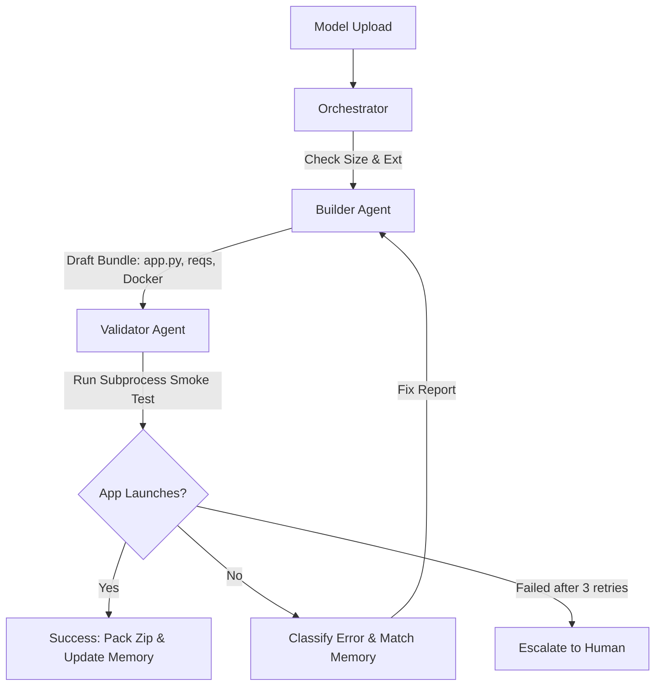

# ML Deployment Concierge

A multi-agent self-correcting packaging assistant designed to build, test, and package deployment-ready Gradio/Docker bundles for Hugging Face Spaces starting from just a trained ML model file.

Developed for the Kaggle Capstone (Agents for Business track).

## Features & Architecture

The system consists of two primary agents governed by a central orchestrator:



1. **Builder Agent:** Auto-detects framework, generates draft dependencies, writes standard execution files (`app.py`, `Dockerfile`, `requirements.txt`, `README.md`), and edits them based on validator error reports and skill memory.
2. **Validator Agent:** Sets up an isolated test virtual environment, applies **Fast Stubbing** for heavy machine learning packages to execute local smoke tests in seconds, launches the Gradio app in a subprocess, monitors startup markers, and extracts & classifies failure stack traces.
3. **Skill Memory:** A persistent `skill_memory.json` that stores error signature mappings to known solutions (e.g. TF/Keras mismatch, missing `audioop`/`imp` modules on newer Python environments), matching patterns before generating fixes, and saving newly resolved bugs automatically.
4. **Structured Logging:** Every step, tool call, input, and output is logged with timestamps to `logs/run_<timestamp>.json` for complete observability.

---

## Getting Started

### Prerequisites
* Python 3.10+ (Tested on Python 3.14.3)
* Standard libraries (`venv`, `subprocess`, `shutil`, `json`)

### Installation
1. Clone the repository and navigate to the directory:
   ```bash
   cd ML_Deployment_Concierge
   ```
2. Install Gradio (used for the dashboard):
   ```bash
   pip install gradio
   ```

---

## How to Run

### 1. Launch the Gradio Dashboard
Start the local dashboard to upload models and view real-time agent execution logs:
```bash
python app.py
```
Open `http://127.0.0.1:7860` in your web browser.

### 2. Run the Evaluation Harness
Execute the evaluation harness to test the pipeline against all 4 pre-seeded test scenarios:
```bash
python run_eval.py
```

---

## Seeded Evaluation Cases (`eval_cases/`)
1. **Clean Scikit-Learn Model (`clean_sklearn_model.pkl`):** Standard model. Checks if the pipeline identifies a missing import (`joblib`) and corrects it in `requirements.txt`.
2. **Dependency Conflict Model (`dependency_conflict_model.keras`):** Keras model that triggers a simulated `audioop` import error (common on Python 3.13+), checking if the Builder reads `skill_memory.json` to resolve it.
3. **Corrupted Model File (`corrupted_model.keras`):** Fails smoke-test loading immediately, verifying the system rejects corrupted file internal structures.
4. **Oversized Model File (`oversized_model.bin`):** Exceeds the 10MB size guardrail, demonstrating immediate rejection.
